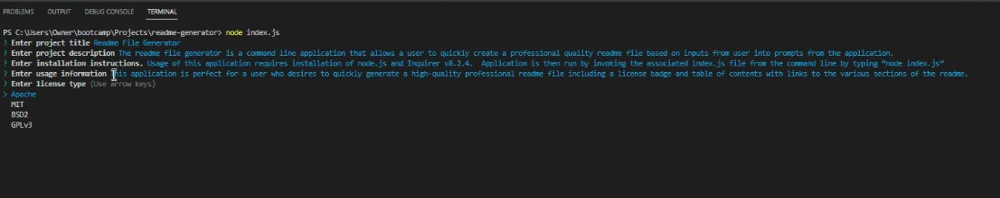

# Weekly Challenge 09 Professional readme file generator.

## Link to Video Demo of Application

https://drive.google.com/file/d/1fChG7VEgWS1UqT8aPx4rfM1cousxxe6A/view

## Description

The readme file generator is a command line application that allows a user to quickly create a professional quality readme file based on inputs from user into prompts from the application.

## Installation

N/A

## Usage

This application is perfect for a user who desires to quickly generate a high-quality professional readme file including a license badge and table of contents with links to the various sections of the readme.e.

## Credits

Badges created using shields.io.

## License

Please refer to the LICENSE in the repo.
